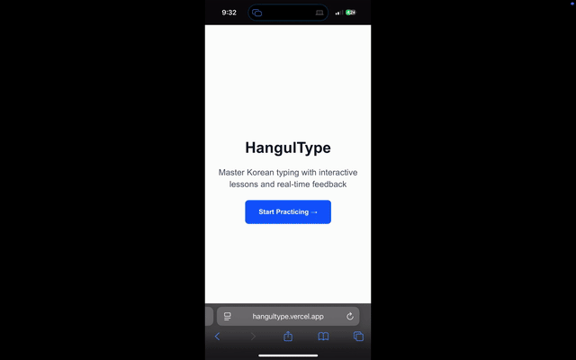

# HangulType - Korean Typing Practice

An interactive web app that helps people learn to type in Korean! Built with React and TypeScript.

## Demo

### Desktop


▶️ [Watch full demo (higher quality, same video)](https://youtu.be/UuQhGMH6BvU)

### Mobile


▶️ [Watch full demo (higher quality, same video)](https://youtu.be/CoKIRbuFOO0)

## Try It Now

**[Live Demo - hangultype.vercel.app](https://hangultype.vercel.app/)**

### How It Works:
1. **Pick a lesson** - Start with "Basic Vowels" for beginners
2. **Follow the guidance** - Colored character boxes show your progress, keyboard highlights next keys
3. **Get real-time help** - See hints like "Hold Shift, then press ㅂ for ㅃ" for complex characters
4. **Track your improvement** - Watch your WPM and accuracy improve as you practice!

### Recommended Learning Path:
- **Basic Vowels** → Learn `ㅏ ㅓ ㅗ ㅜ` fundamentals
- **Basic Consonants** → Practice `ㄱ ㄴ ㄷ ㅁ ㅂ ㅅ` 
- **Complex Vowel Patterns** → Master combinations like `ㅘ ㅙ ㅢ`
- **Double Consonants** → Advanced shift combinations `ㄲ ㄸ ㅃ ㅆ ㅉ`

## Why I Built This

As someone interested in Korean language learning, I noticed that existing typing tutors didn't offer Korean or had interfaces entirely in Korean. Korean is unique because each "letter" is actually made up of multiple parts that combine together.

For example, the character `한` is made from three pieces: `ㅎ` + `ㅏ` + `ㄴ`. This makes typing in Korean way more complex than English, so I wanted to build something that could actually teach this properly.

## Key Features

**Smart Character Analysis** - Real-time Korean syllable decomposition using Unicode mathematics  
**Intelligent Guidance** - Context-aware hints for complex characters like "Hold Shift, then press ㅂ for ㅃ"  
**Performance Tracking** - Live WPM calculation and accuracy monitoring  
⌨**Visual Keyboard** - Interactive Korean keyboard with real-time highlighting  
**Mobile Optimized** - Responsive design that works seamlessly on phones and tablets  
**Progress Persistence** - Automatically saves your lesson progress locally  
**Structured Learning** - Progressive lessons from basic vowels to complex character combinations  

## Technologies Used

- **React 18** - For the interactive user interface
- **Next.js** - React framework with file-based routing
- **TypeScript** - For type safety and better developer experience  
- **Tailwind CSS** - For responsive styling and design
- **Custom React Hooks** - Clean separation of business logic and UI

## Performance & Compatibility

- **Real-time character analysis** 
- **Cross-browser compatible** 
- **Mobile optimized** 

## The Technical Stuff

### How Korean Character Processing Works

This was the most challenging part! Korean characters (Hangul) are stored in Unicode using a systematic mathematical formula. Each syllable has:

- **Initial consonant** (like ㄱ, ㄴ, ㄷ)
- **Medial vowel** (like ㅏ, ㅓ, ㅗ)  
- **Optional final consonant**

The app uses Unicode mathematics to break down characters like `한` into `['ㅎ', 'ㅏ', 'ㄴ']` so it can guide you through typing each component in the correct sequence.

```javascript
// Example: Breaking down Korean syllables
const syllableIndex = charCode - 0xAC00;
const initialIndex = Math.floor(syllableIndex / (21 * 28));
const medialIndex = Math.floor((syllableIndex % (21 * 28)) / 28);
const finalIndex = syllableIndex % 28;
```

### Project Architecture

I organized the code using modern React patterns to keep everything maintainable:

```
📁 hooks/
├── useKoreanTyping.ts      # Core typing mechanics and character analysis
├── usePerformanceTracking.ts  # WPM calculation and accuracy tracking  
└── useLessonProgress.ts    # Lesson navigation and progress management

📁 components/practice/
├── CharacterDisplay.tsx    # Colored character feedback boxes
├── LessonIntro.tsx        # Lesson instructions and setup
├── PerformanceStats.tsx   # Real-time WPM/accuracy display
└── CompletionModal.tsx    # Lesson completion celebration

📁 utils/
├── korean/                 # Korean language processing utilities
│   ├── decomposition.ts   # Unicode syllable breakdown
│   ├── guidance.ts        # Smart typing assistance
│   └── mappings.ts        # QWERTY ↔ Korean key mappings
└── typing/                 # General typing utilities
    ├── accuracy.ts        # Word-level accuracy calculations
    └── textSplitting.ts   # Lesson text segmentation
```

## What I Learned

Building this project taught me a lot about several complex technical areas:

**Unicode & Character Encoding**
- Korean Hangul Unicode systematization (U+AC00 to U+D7A3 range)
- Mathematical decomposition of 11,172 possible syllable combinations
- Cross-browser Input Method Editor (IME) compatibility challenges

**Advanced React Development**
- Custom hooks for complex state management with real-time requirements
- Performance optimization using `useMemo` and `useCallback` for expensive operations
- Component composition patterns for maintainable and testable code

**User Experience Design**
- Designing intuitive visual feedback for complex character formation processes
- Creating helpful guidance without overwhelming new learners

**Real-time Performance**
- Efficient algorithms for Unicode text processing at typing speeds
- State synchronization for multiple interdependent UI updates
- Memory management for extended practice sessions

## Future Ideas

### Next Features I'm Planning:
- **Full sentence practice** with common Korean phrases and grammar patterns
- **Korean number systems** - lessons for both native Korean and Sino-Korean numbers
- **Audio integration** - pronunciation practice alongside typing
- **Custom lesson creator** - let users create and share their own practice content

### Longer-term Vision:
- **User accounts** with cloud progress synchronization
- **Typing games and challenges** to make practice more engaging

---

*Thanks for checking out my project! I hope this helps make it fun and intuitive. 화이팅!*
